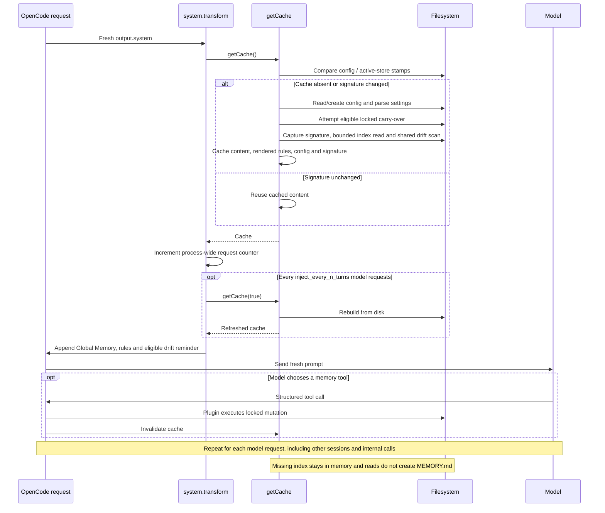
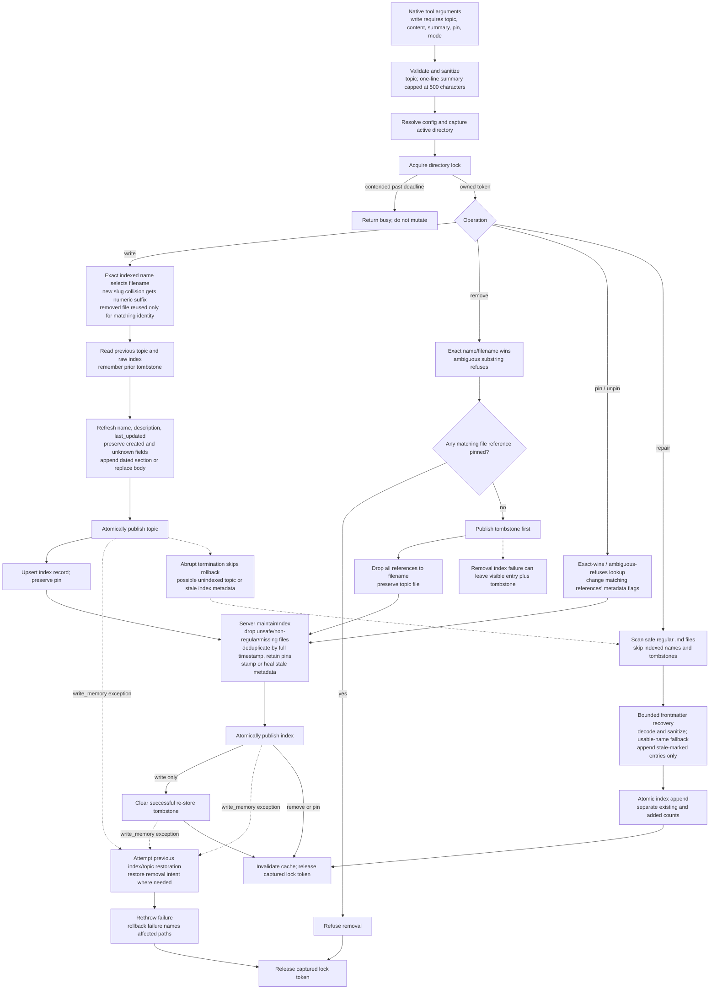
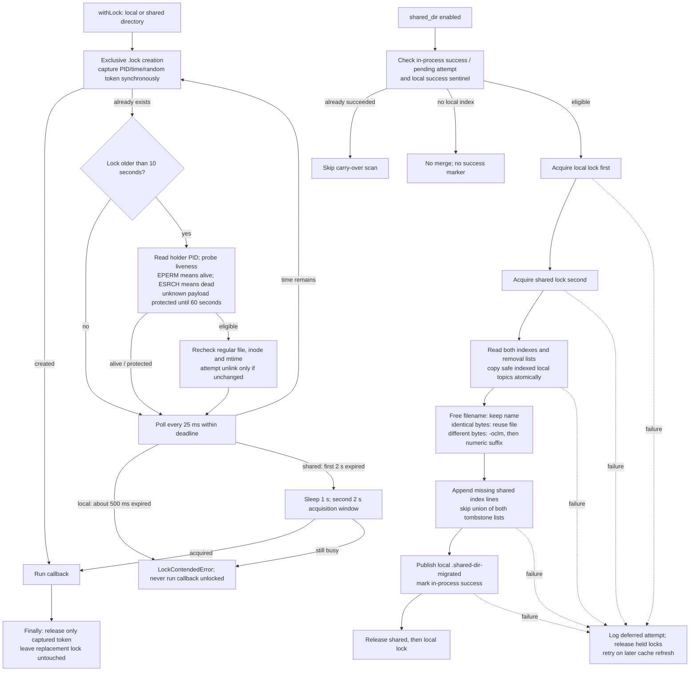
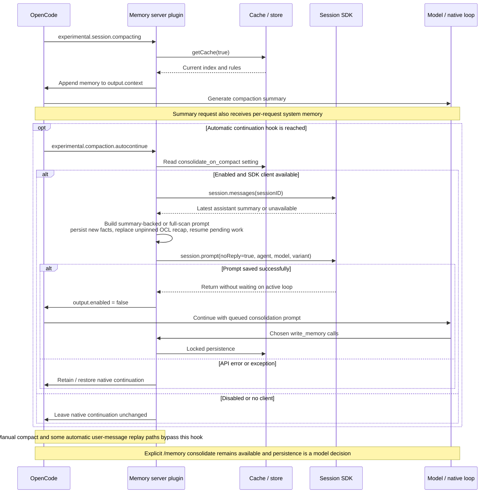

# Architecture & Internals

[Back to README](../README.md)

## Plugin architecture

| Path | Role |
|---|---|
| `.opencode/plugins/ocl-memory.mjs` | Server hooks, four native tools, per-request injection, stamp-checked cache, dynamic `/memory`, and automatic consolidation. |
| `.opencode/plugins/ocl-memory-shared.mjs` | Pure shared module: path/config resolution, JSONC parsing, safe reads, atomic file writes, tombstones, locks, and carry-over. |
| `.opencode/plugins/ocl-memory-tui.mjs` | Separate TUI entry: `ctrl+alt+m`, bounded topic previews, locked pin/removal actions, and visible errors. |
| `.opencode/command/memory.md` | Static `/memory` fallback; resolves the active directory before reads. Dynamic registration normally replaces it. |
| `skills/memory/SKILL.md` | Agent reference for reading, writing, pinning, repair, and consolidation. |
| `tests/smoke-test.mjs` | Sequential isolated regression suite, including injected filesystem failures. |
| `tests/shared-store-test.mjs` | Two real writer processes; optional sibling pi core exercises cross-harness storage. |
| `tests/host-test.mjs` | Real OpenCode server with a local fake model and temporary storage. |

Server and TUI entry points remain separate because current OpenCode modules cannot export both targets from one entry. The server's legacy function export loads through the manifest `main`; TUI loads through `exports["./tui"]`. The shared module exports no plugin hooks.

## Scope

Memory is global: one active index plus topic files, either local or shared across tools. It supports native write/remove/pin/repair tools, behavioral persist rules, a model-free TUI browser, and consolidation prompts. It does not provide semantic retrieval, encryption, per-project storage, or a distributed database.

## System Compatibility

| Requirement | Status |
|---|---|
| OpenCode | 1.18.34 verified against release source and the real-server check; older releases have not been revalidated. |
| Node.js | Manifest requires >=18; local checks used Node 26.10.0 and CI uses Node 22. No runtime dependencies. |
| macOS | Verified locally; paths follow `XDG_CONFIG_HOME` or `~/.config/opencode/`. |
| Linux | Supported local-filesystem design; this verification ran on macOS. |
| Windows | Not supported. |

TUI signatures and mutations are verified against the current API and isolated tests. The host test does not exercise interactive terminal rendering.

## Storage and mutation safety

An index record has one physical line: `- [Name](topic.md) [pin] timestamp [stale?] -- summary`. Topic names and summaries are sanitized before writing; summaries are capped at 500 characters. Metadata flags are read only before the summary separator, and duplicate timestamps are compared at full precision. Repair remains additive-only and reports existing plus newly added entries without double-counting.

Topic filenames must be safe non-hidden `.md` basenames, excluding `MEMORY.md`, separators, `..`, control characters, and link-breaking characters. Store reads open without following final-component symlinks, use nonblocking open to avoid hanging on FIFOs, and verify a regular descriptor. Trusted config symlinks are supported, with target changes included in cache stamps. Index injection reads at most 50 KiB plus an overflow byte; frontmatter and TUI previews are bounded too. Mutation reads retain full content so updates do not truncate existing files.

Writes use exclusive temporary files in the destination directory, flush their contents, and rename over regular-file targets. Temporary files are cleaned on exceptions. Config bootstrap uses exclusive publication instead of overwriting another creator's config; legacy config is copied successfully before its original is renamed, and an existing backup is preserved.

Every index mutation holds the active directory lock. Local contention refuses after about 500 ms; shared contention uses two acquisition windows of about 2 s with a 1 s retry delay. Lock tokens contain PID, timestamp, and randomness; `EPERM` means alive. Stale reclaim checks holder liveness and rechecks inode/mtime, and release verifies ownership. No local write proceeds unlocked.

Removal persists its tombstone before dropping index discoverability. A re-store reuses a removed file only when its frontmatter identifies the same topic; unrelated slug collisions get a numeric suffix. Writes refresh current frontmatter metadata and roll back topic/index changes if a subsequent ordinary filesystem operation fails. Rollback failure is reported explicitly. The TUI rechecks pin protection inside the lock and shows busy, refusal, and filesystem errors.

Carry-over takes the local lock before the shared lock, copies atomically, respects both tombstone lists, and records completion only after success. Failed or contended attempts retry on a later cache refresh. See [shared storage](shared-directory.md).

## Disk I/O and injection overhead

Every model request receives the cached index and rendered behavioral rules. File-stamp checks detect changes before cache reuse; tool mutations, compaction, and the configured request interval trigger full content refreshes. Sentinels are observed, not consumed. There is no file watcher and no session-wide injection gate. See [memory injection](memory-injection.md) for details.

## Token overhead

Index and rule tokens are part of each request, regardless of the refresh interval. Cost depends on index length, tokenizer, and provider caching. Non-empty behavioral arrays render as markdown; malformed JSONC or config with no non-empty behavioral arrays falls back to raw text. Topic bodies add context only when loaded. The 50 KiB index cap is a byte bound, not a fixed token count.

## Model compatibility

The host integration needs structured tool calls and ordinary system-prompt support. Filesystem validation, formatting, timestamps, and locking are handled by the plugin. Which facts to persist, their correctness, and whether to follow the persist rules remain model decisions; model-free TUI actions avoid that dependency.

## Recovery boundaries

Atomicity is per file, not a transaction across topic, index, and tombstone files. Normal exceptions trigger write rollback, but abrupt termination can leave an unindexed topic or stale index metadata; `/memory repair` recovers missing entries, not metadata for entries already indexed. Directory entries are not fsynced, so this is not a power-loss durability guarantee. Cooperating writers must share the `.lock` protocol on a local filesystem; manual writers and network filesystem behavior are outside that guarantee. Token and inode checks narrow lock replacement races, but the filesystem provides no atomic compare-and-unlink operation.

## Architecture diagrams

These diagrams trace the 0.6.7 implementation in the three plugin modules, command template, skill, and tests. Solid arrows show calls or data flow; dotted arrows show observation, guidance, or verification. OpenCode integration is verified on 1.18.34. The pi co-tenant is an external cooperating writer, not part of this plugin's runtime.

## Complete system map

```mermaid
flowchart TB
  subgraph host["OpenCode host"]
    user["User"]
    loader["Plugin loading and config hook"]
    command["/memory command"]
    requests["Fresh model requests<br/>conversation steps, other sessions, internal calls"]
    compact["Compaction"]
    model["Model / agent<br/>chooses persistence and loads details on demand"]
    readtool["Host file-read tool<br/>topic bodies are not automatically injected"]
  end

  subgraph server["Server entry: ocl-memory.mjs"]
    register["Register skill path, dynamic command, four tools"]
    cmdhook["command.execute.before<br/>refresh active paths and substitute arguments"]
    systemhook["experimental.chat.system.transform<br/>attach index and rules every request"]
    compacthook["experimental.session.compacting<br/>force fresh memory into output.context"]
    autohook["experimental.compaction.autocontinue<br/>optional queued consolidation"]
    cache["getCache / process-global cache<br/>config, rendered rules, index, drift, signature"]
    stamps["Signature checks before reuse<br/>config and symlink target, directory,<br/>index, tombstones, notification sentinel"]
    refresh["Rebuild on miss, changed stamps, force refresh<br/>or every N model requests"]
    render["Render non-empty behavioral arrays<br/>raw-config fallback if absent or invalid"]
    indexread["Bounded index read<br/>line limit and 50 KiB injection cap"]
    drift["Shared-mode drift count<br/>more than 5 missing topics: repair reminder"]
    write["write_memory<br/>append or replace"]
    remove["remove_memory<br/>exact match wins; ambiguous partial refuses"]
    pin["pin_memory<br/>exact match wins; ambiguous partial refuses"]
    repair["repair_memory<br/>explicit additive recovery"]
    invalidate["invalidateCache<br/>tool mutations and memory tool.execute.after"]
  end

  subgraph tui["TUI entry: ocl-memory-tui.mjs"]
    key["ctrl+alt+m<br/>registered keymap layer; disposed on lifecycle end"]
    resolve["resolveActiveDir<br/>read config on each browser open"]
    browser["Index browser<br/>50 KiB read; filter and select"]
    preview["Topic preview<br/>64 KiB read; strip frontmatter; first 10 lines"]
    tuipin["Pin / unpin matching filename"]
    tuiremove["Confirm removal<br/>recheck pins inside lock"]
    alerts["Busy, refusal and filesystem alerts<br/>notification failure reports committed index"]
  end

  subgraph shared["Shared pure module: ocl-memory-shared.mjs"]
    rules["readMemoryRules / stripJsonc / parseRules<br/>exclusive bootstrap; legacy copy then backup"]
    paths["getMemoryDir / getMemoryIndex<br/>capture active directory before mutation lock"]
    migration["maybeCarryOverToSharedDir<br/>one successful local-to-shared merge"]
    lock["withLock<br/>fail closed; capture acquisition token"]
    safe["Safe filenames and descriptor reads<br/>nonblocking, no-follow, regular-file verification"]
    atomic["Atomic file publication<br/>exclusive temp, file fsync, rename, cleanup<br/>config creation uses exclusive hard-link publication"]
    tombhelpers["Read / add / remove tombstones"]
  end

  subgraph disk["Filesystem"]
    cfg[("Local memory.jsonc<br/>XDG_CONFIG_HOME/opencode or ~/.config/opencode")]
    legacy[("Local memory/RULES.jsonc<br/>legacy fallback and preserved .bak")]
    local[("Local memory directory<br/>migration source or active local store")]
    marker[("Local .shared-dir-migrated<br/>written only after successful merge")]
    subgraph active["Active store: local memory/ OR ~/.agents/memory/"]
      idx[("MEMORY.md<br/>one physical record per topic")]
      topics[("Safe topic .md files<br/>quoted frontmatter and Markdown body")]
      removed[(".ocl-removed<br/>intentional-removal filenames")]
      notification[(".invalidate<br/>observed, never consumed")]
      lockfile[(".lock<br/>PID, timestamp, random token")]
    end
  end

  subgraph guidance["Agent guidance and verification"]
    skill["skills/memory/SKILL.md<br/>loaded on demand"]
    fallback[".opencode/command/memory.md<br/>static fallback resolves config and active paths"]
    tests["smoke-test: isolated regressions and fault injection<br/>shared-store-test: real writer processes<br/>host-test: real server with local fake model"]
    pi["Updated pi co-tenant<br/>independent local config and injection semantics"]
  end

  user --> command --> cmdhook --> model
  user --> key --> resolve --> browser
  loader --> register
  register --> skill
  register --> command
  fallback -.-> command
  skill -.-> model
  requests --> systemhook --> cache
  compact --> compacthook --> cache
  compact --> autohook
  autohook --> cache
  cache --> stamps
  stamps --> refresh
  refresh --> rules --> cfg
  rules --> legacy
  refresh --> migration
  refresh --> paths
  refresh --> render
  refresh --> indexread --> safe
  refresh --> drift
  indexread --> idx
  drift --> topics
  drift --> removed
  cache --> systemhook
  systemhook --> model
  cache --> compacthook
  compacthook --> compact
  stamps -.-> cfg
  stamps -.-> idx
  stamps -.-> removed
  stamps -.-> notification
  model --> readtool --> topics
  model --> write
  model --> remove
  model --> pin
  model --> repair
  write & remove & pin & repair --> paths --> lock
  write & remove & pin & repair --> invalidate --> cache
  resolve --> rules
  resolve --> paths
  resolve --> migration
  browser --> safe
  browser --> idx
  browser --> preview --> safe
  preview --> topics
  browser --> tuipin & tuiremove
  tuipin & tuiremove --> lock
  tuipin & tuiremove --> alerts
  tuipin & tuiremove --> notification
  lock --> lockfile
  lock --> safe
  lock --> atomic
  lock --> tombhelpers --> removed
  atomic --> idx & topics
  atomic -->|"exclusive config publication"| cfg
  rules --> atomic
  migration --> local
  migration --> lock
  migration --> marker
  safe --> idx & topics & removed
  pi --> lockfile
  pi --> idx & topics & removed
  tests -.-> server
  tests -.-> tui
  tests -.-> shared
  tests -.-> pi
```

The model's ordinary host file reads are distinct from the plugin's guarded storage reads. Persist rules and the skill guide model choices; they are not permission enforcement. The TUI performs mutations directly, without a model turn, and does not run the server's general index-maintenance pass.

## Request injection and cache lifecycle

## Mutation, maintenance and recovery

Rollback applies to the server's `write_memory` publication sequence, not every mutation or migration. Repair only restores missing discoverability; it does not refresh already-indexed metadata or recover pin flags from a lost index. TUI pin/removal updates use the same lock, safe reads, atomic writes, and removal-intent ordering, then atomically notify through `.invalidate`; they show errors instead of silently swallowing results.

## Locking and one-time migration

The protocol is advisory and has no atomic compare-and-unlink primitive. Data files are flushed, but directory entries are not fsynced. Migration copies rather than moves and has no whole-operation rollback; successful path toggles do not restart migration or synchronize inactive stores.

## Compaction and automatic consolidation

## Implementation anchors

| Area | Code to inspect |
|---|---|
| Registration, dynamic command, injection, compaction and consolidation | [`ocl-memory.mjs`](../.opencode/plugins/ocl-memory.mjs): plugin factory and returned hooks |
| Cache and rule rendering | `fileStamp`, `cacheSignature`, `getCache`, `renderRulesForInjection`, `readMemoryIndex` |
| Tools, maintenance, repair and drift | `tools`, `maintainIndex`, `findIndexEntry`, `upsertIndexLine`, `readFrontmatter`, `repairMemoryIndex`, `countMemoryFiles` |
| File boundaries, config and locks | [`ocl-memory-shared.mjs`](../.opencode/plugins/ocl-memory-shared.mjs): `readStoreFileSync`, `atomicWriteFileSync`, `isSafeFilename`, `readMemoryRules`, `parseRules`, `withLock` |
| Migration and collision handling | `maybeCarryOverToSharedDir`, `mergeLocalIntoSharedDir`, `resolveDestName`, `filesEqual` |
| TUI navigation, mutations and notifications | [`ocl-memory-tui.mjs`](../.opencode/plugins/ocl-memory-tui.mjs): `resolveActiveDir`, `parseIndex`, `readTopic`, `setPin`, `removeEntry`, `runMutation` |
| Behavioral guidance | [`memory command`](../.opencode/command/memory.md), [`memory skill`](../skills/memory/SKILL.md) |
| Executable verification | [`smoke tests`](../tests/smoke-test.mjs), [`shared writer tests`](../tests/shared-store-test.mjs), [`host tests`](../tests/host-test.mjs) |
